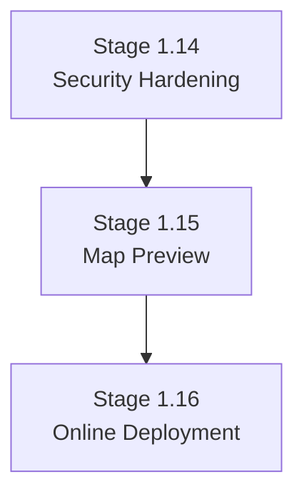

# Sigma Future Fix Notes

## Summary

Sigma is valuable for CanopySense because it enforces clear intent, planning, execution evidence, and Director approval gates. The governance model helps prevent scope drift and makes review findings easier to trace.

The main improvement area is not the concept. It is CLI and state-management ergonomics. Some flows are too easy to desynchronize or require mechanical state transitions that feel unnatural after evidence is already complete.

## What Works Well

- Gate discipline prevents coding before intent and plan are clear.
- Separate artifacts create a useful audit trail:
  - Intent Doc
  - Plan Doc
  - Execution Evidence
  - Roadmap
  - Closure Doc
- Role boundaries are helpful for large projects with backend, frontend, DB, pipeline, security, and deployment concerns.
- Test contracts make review more precise. Example: v1.10 caught the manager `full_name` invite issue and inactive-login token issue because the Plan Doc had explicit requirements.
- Director approval authority is clear and reduces accidental locking or scope changes.

## Main Pain Points

### 1. Active Artifact Ambiguity

When multiple Plan Doc drafts existed at once, the active plan shifted in a surprising way. This created risk of locking the wrong artifact.

Current workaround:

```bash
sigma plan activate --v v1.11
sigma plan lock
```

Better direction:

```bash
sigma plan lock --v v1.11
```

Version-targeted lock commands would reduce accidental state mistakes.

### 2. Rigid Execution Evidence State Transitions

Execution Evidence had complete reviewed evidence, but the CLI required:

```text
DRAFT -> BUILDING -> TESTING -> COMPLETED -> LOCKED
```

This is conceptually valid, but the CLI flow felt mechanical when the evidence was already complete.

Better direction:

```bash
sigma exec lock --finalize
```

This command could show a confirmation prompt and then safely advance through required states before locking.

### 3. Error Messages Need Exact Next Steps

Example issue:

```text
Active DEV-EXEC must be in COMPLETED state to lock. Run: sigma exec advance complete
```

But the current state was `DRAFT`, so `advance complete` failed.

Better error:

```text
Cannot lock DEV-EXEC v1.10.
Current state: DRAFT
Required path:
  sigma exec advance building
  sigma exec advance testing
  sigma exec advance complete
  sigma exec lock
```

### 4. Roadmap Lifecycle Needs Versions

Roadmap was marked `LOCKED`, but real project planning still required updates when v1.11, v1.12, and v1.13 were added.

Better direction:

```text
ROADMAP v1 LOCKED
ROADMAP v2 DRAFT
ROADMAP v2 LOCKED
```

This would preserve the meaning of locked artifacts while allowing formal roadmap revisions.

### 5. Parallel Draft Policy Should Be Explicit

The Sigma fix that blocks normal `plan new` when another DRAFT exists is good.

Recommended addition:

```bash
sigma plan new --parallel-draft
```

This should require explicit Director confirmation and clearly mark the risk:

- multiple drafts exist
- active draft must be selected before lock
- commands should prefer `--v` targeting

### 6. Lock Preflight Should Be Standard

Before any lock, Sigma should show a preflight summary:

```text
Artifact: Plan Doc v1.11
State: DRAFT
Intent Ref: v2
Stale Intent: no
Known Draft Conflicts: v1.12 exists
Gate Impact: Gate 2 will open

Type APPROVE to lock.
```

This reduces accidental locks and makes Director authority more concrete.

## Recommended Future Fixes

1. Add version-targeted lock commands:
   - `sigma plan lock --v v1.11`
   - `sigma exec lock --v v1.11`

2. Add finalize lock command for Execution Evidence:
   - `sigma exec lock --finalize`

3. Improve CLI error messages with full required transition paths.

4. Add formal Roadmap versioning:
   - `sigma roadmap new`
   - `sigma roadmap lock`
   - `sigma roadmap status`
   - `sigma roadmap list`

5. Keep draft conflict guard, but add explicit parallel draft mode:
   - `sigma plan new --parallel-draft`

6. Add lock preflight summaries for Plan Doc and Execution Evidence.

7. Add safer current-state diagnostics:
   - show active artifact
   - show all DRAFT artifacts
   - warn if active artifact is not the latest draft

8. Prefer command suggestions that include the artifact version.

---

## DEV Role Feedback (from v1.13 Data Viewer implementation)

### What Works Well (DEV Perspective)

- **FMN-PLAN as a locked contract** is the highest-value artifact from DEV's perspective. Once Gate 2 is open, scope is unambiguous. No guessing what to build. Every task and test case is traceable.
- **FMN post-build advisory** caught a real bug (AC-003 frontend guard gap) that DEV missed. The independent review cycle is not ceremonial — it produces concrete corrections.
- **Gate system** prevented DEV from starting against a DRAFT plan. When FMN-PLAN v1.13 was still DRAFT and Director asked to open DEV-EXEC v1.13, the gate mismatch was flagged before any code was written. This is the system working as designed.
- **Role immutability** keeps DEV focused. No context-switching into "what would ARC decide?" during implementation.

### Pain Points (DEV Perspective)

#### 7. DEV-EXEC Section Redundancy Creates Documentation Drift Risk

When a deviation is found mid-implementation (example: schema fix in v1.13), DEV must update the same fact in 6 separate sections: Section 2, 6, 8, 9, 10, and 12. This creates drift risk — in v1.13, "29 tests" appeared in one section and "30 tests" in another because the schema correctness test was added mid-smoke and not all sections were updated atomically.

**Initial proposal (retracted):** Consolidate to a single Deviation Log, other sections reference it.

**Why retracted:** After discussion with Director, the redundancy has a structural function. It creates multi-point verification — if Section 8 and Section 12 describe the same fact differently, that discrepancy is a signal to FMN. Collapsing to a single source of truth removes that triangulation mechanism. The real problem is not the redundancy itself but the absence of a DEV update checklist that ensures all sections are updated atomically when a deviation occurs.

**Revised proposal:** Add an explicit "Deviation Update Checklist" inside DEV-EXEC or in DEV-RULE.md. When a deviation is recorded in Section 6, the checklist enumerates exactly which other sections require a corresponding update. This preserves multi-point verification while making the update procedure explicit rather than relying on DEV memory.

#### 8. Issues Caught Post-Build That Could Be Caught Pre-Build

In v1.13, three FMN review cycles occurred:
1. FMN: browser smoke pending → DEV runs smoke
2. FMN: AC-003 frontend guard missing → DEV adds SuperAdminRoute
3. FMN: verified → READY_FOR_LOCK

Cycles 1 and 2 were both valid and productive. The concern is not the number of cycles but the **timing** — AC-003 was a frontend RBAC gap that could have been identified before implementation started if DEV-EXEC draft review included an explicit security checklist question: *"For each new frontend route: is the route guard consistent with the backend auth dependency?"*

**Proposal:** Add a pre-build security checklist to the DEV-EXEC draft phase (Section 2 or a new Section 2a). Before implementation begins, DEV answers a short set of structured questions — route guards, RBAC consistency, sensitive field exclusion. FMN reviews these answers as part of the plan review before Gate 2 opens. This shifts some catches from post-build to pre-build without adding a new gate.

#### 9. Bootstrap Protocol Overhead When Context Is Fresh

The 4-step bootstrap (sigma-memory query, `sigma --help`, `sigma session bootstrap`, report lifecycle) is valuable when DEV enters a session cold. However, when a session continues directly from a recent FMN advisory with full context still active, the syntax verification step (`sigma --help`) and memory query feel mechanical rather than informative.

**Proposal:** No structural change needed — this is a discipline issue more than a protocol issue. Consider adding a note to DEV-RULE.md: "If a CSO or active FMN advisory exists from within the same work session, bootstrap may begin at step 3 (session bootstrap) with a brief note that steps 1–2 were skipped due to warm context." This avoids false ceremony while preserving the protocol for cold starts.

#### 10. Authorization Language Gap in Practice

DEV-RULE.md correctly distinguishes clear authorization ("approved", "lock it") from ambiguous language ("okay", "noted"). In practice, Directors sometimes use borderline phrases mid-conversation and DEV must interrupt to ask for clarification. This is correct behavior per the rules but creates friction in otherwise smooth sessions.

**Proposal:** Expand the authorization language examples in DEV-RULE.md with Indonesian equivalents and borderline cases with explicit rulings. Examples:
- "silakan" → ambiguous, not sufficient
- "lanjutkan" → ambiguous, not sufficient  
- "ya, lanjutkan lock" → sufficient
- "oke dikunci" → sufficient

A short reference table in the rules reduces the need for clarification requests without relaxing the authorization standard.

#### 11. decisions.jsonl Not Referenced in DEV Bootstrap Protocol

`Sigma/memory/decisions.jsonl` is the project-level record of all Director decisions: every lock event, Director notes, approved scope, deferred items, accepted risks, and constraints. It is the most complete picture of "how we got here and what was agreed."

During v1.13, DEV did not read this file. Root cause: it is not referenced anywhere in the DEV bootstrap protocol or the `/dev` skill file. The 4-step bootstrap directs DEV to sigma-memory MCP (ecosystem constants), `sigma --help` (CLI syntax), and `sigma session bootstrap` (reads `progress.json` for current state). None of these cover project decision history.

`CLAUDE.md` mentions the file exists ("Project decisions are recorded in `Sigma/memory/decisions.jsonl` (CLI-written)") but contains no directive on when or by whom it should be read.

The result: DEV enters implementation with current gate state but without full context of Director constraints, deferred scope, and accepted risks from previous stages. This is a silent gap — DEV does not know what is missing.

**Critical design constraint:**

`decisions.jsonl` is orientation context only — a summary of the project journey and Director decisions. It is NOT a substitute for reading the locked source artifacts. If the bootstrap protocol directs DEV to `decisions.jsonl` without an explicit guardrail, there is a real risk DEV stops at the summary and skips reading the FMN-PLAN, DEV-EXEC, and CSO files that contain the actual implementation contract and technical constraints. A convenient summary creates false confidence.

Both fixes below must include this guardrail.

**Additional finding — full file is too noisy for focused reading:**

`decisions.jsonl` at v1.13 contains 27 entries, 265KB. 40% of entries (11 EXEC locks) have zero director notes — pure state transitions with no substantive content. PLAN locks from v1.1–v1.10 are superseded and not relevant to current stage work. The entries with actual value for DEV working on v1.13 are approximately 5 of 27: INTENT v2, ROADMAP, PLAN v1.11, v1.12, v1.13. Reading the full file wastes context budget and risks anchoring on old superseded constraints.

**Two fixes required (both needed):**

**Fix A — Skill file `/dev` (immediate, no CLI change needed):**

Add an explicit step 3b to the bootstrap protocol with a clear positioning statement:

```
3b. Run sigma see memory --dev for project journey orientation
    and Director constraint context ONLY.
    This is NOT a substitute for reading locked artifacts.
    After this step, the following reads remain mandatory:
    - Active FMN-PLAN (implementation contract)
    - Active DEV-EXEC (current execution evidence)
    - Relevant CSO files from Sigma/logs/
```

**Fix B — New CLI command: `sigma see memory --dev`:**

A dedicated, role-scoped memory view command. Does not extend `sigma session bootstrap` (which is already dense). Displays only what is relevant for DEV orientation:

```
$ sigma see memory --dev

=== Director Intent ===
[INTENT LOCKED] v2 — Phase 1 Core Foundation — 2026-05-22
<summary of foundational constraints and deferred scope>

=== Recent Stage Decisions ===
[PLAN LOCKED] v1.13 — Admin Data Viewer — 2026-05-29
[PLAN LOCKED] v1.12 — Estate Onboarding — 2026-05-28
[PLAN LOCKED] v1.11 — ... — 2026-05-28

Note: decisions.jsonl contains 27 entries total.
      Showing INTENT + last 3 PLAN locks only.
      Run sigma see memory --full for complete history.
```

Filters applied: always include INTENT; include last N PLAN locks with non-empty notes; exclude EXEC locks with zero notes; exclude PLAN locks older than current stage minus 3.

This gives DEV the orientation summary it needs without the noise of superseded decisions and empty state transitions. `--full` flag remains available for edge cases requiring full history.

Both fixes are necessary: Fix B provides the right tool; Fix A mandates its use in the bootstrap protocol so DEV cannot skip it.

#### 12. Global AI Agent Rules Can Contaminate Sigma Role Context

During a DEV session in v1.13, the DEV role referred to "ANT" — a role from Delta, the obsolete predecessor to Sigma. Root cause: the global `CLAUDE.md` file (which applies to all projects) still references ANT and CDC as active roles for other projects. When the AI agent loads its context, global rules are present alongside project-specific rules, and without a strong isolation mechanism, deprecated role names can bleed into the wrong project session.

This is a violation of the project isolation principle stated in the global rules themselves: *"Never carry assumptions from one project session into another."* The violation was silent — the AI did not flag the contamination, it simply used the wrong terminology.

The risk is not just terminology. If global rules describe ANT as "the implementing role" and DEV internalizes that framing in a Sigma session, it could subtly affect how implementation decisions are reasoned about — even if the output looks correct on the surface.

**This finding is flagged for Director review of all global AI agent rules.** The specific concern: any global rule file that names roles from a deprecated system should either be updated to reflect the current system or explicitly scoped so it cannot bleed into Sigma sessions.

**Sigma-side mitigation (independent of global rule review):**

Add an explicit role isolation reminder to all Sigma skill files at activation:

```
Active governance system: SIGMA
Valid roles in this session: ARC, FMN, DEV, AUD
Any reference to ANT, CDC, GMN, or Delta roles is an error.
If you detect yourself using those terms, stop and correct immediately.
```

This does not fix the root cause (global rule contamination) but creates a local guardrail that catches the slip before it reaches the Director.

### Proposals Summary (DEV)

| No | Proposal | Rationale |
| :--- | :--- | :--- |
| 7 | Add Deviation Update Checklist to DEV-RULE.md or DEV-EXEC template | Preserves multi-point verification; eliminates drift from incomplete updates |
| 8 | Add pre-build security checklist to DEV-EXEC draft phase | Shifts RBAC/route guard checks from post-build to pre-build; reduces NEEDS_DEV_UPDATE cycles |
| 9 | Allow bootstrap step 1–2 skip when warm CSO/advisory context exists | Reduces ceremony; warm-context note in DEV-RULE.md sufficient |
| 10 | Expand authorization language table with Indonesian equivalents and borderline rulings | Reduces clarification interruptions without relaxing Director authority standard |
| 11 | Add `sigma see memory --dev` command + update DEV skill bootstrap (step 3b) | DEV currently enters implementation without full Director constraint context; full decisions.jsonl too noisy |
| 12 | Review and isolate global AI agent rules from Sigma sessions + add role isolation reminder to all Sigma skill files | Global rules referencing Delta roles (ANT/CDC/GMN) can silently contaminate Sigma sessions |

---

---

## Roadmap Section Management (Feature Idea)

### Problem

When inserting a new stage mid-roadmap (e.g., inserting Stage 1.15 between 1.14 and the old 1.15), FMN must manually:
- Add a row to the Stage Overview table (Section 3)
- Add a full `### Stage X.Y` detail block (Section 4)
- Update the mermaid/text dependency tree (Section 5)
- Add a row to the PLAN Breakdown table (Section 6)
- Add a row to the Pending Items table (Section 7)
- Update FMN Notes (Section 8) and Director Notes (Section 9)
- Rename all references to the bumped versions throughout

This is error-prone and was observed in CanopySense Stage 1.15 insertion (2026-05-30).

### Core Design Principle

**H2 heading = the CLI-managed atomic unit.**

Every stage section in ROADMAP must be a top-level H2 with the pattern:

```
## Stage X.Y — Title
```

This is the only H2 format the CLI manages. H2 sections must never be written manually — only via `sigma roadmap section`. All content within an H2 (H3 and below) is the section body and is filled by FMN or auto-generated.

Non-stage H2 headings (e.g., `## Roadmap Policy`, `## Meta`) are ignored by the CLI because they do not match the `## Stage X.Y` pattern.

### Proposed Commands

#### `sigma roadmap section --header X.Y --title "..."`

Insert a new stage section at position X.Y.

Behavior:
1. Scan all H2 headings matching `## Stage X.Y` pattern.
2. If X.Y does not exist: insert new H2 with template body at the correct sorted position.
3. If X.Y already exists: bump all H2 sections where version >= X.Y by one increment (1.15 → 1.16, 1.16 → 1.17, etc.), then insert new H2 at X.Y.
4. Call `sigma roadmap render` automatically after insert/bump to regenerate all derived content.

Template body inserted for the new section:

```markdown
## Stage X.Y — Title

> ⚠ Need to fill

### Focus

### Main Output

### Main Tasks

### Explicit Non-Scope

### Dependency / Gate Before Next Stage

### Risk / Watch-Out
```

#### `sigma roadmap bump --from X.Y`

Shift all sections with version >= X.Y up by one increment without inserting a new section. Useful when reserving a slot.

#### `sigma roadmap render`

Regenerate all derived content from the current ordered list of H2 sections:
- Stage Overview summary table
- Phase Dependencies mermaid diagram
- PLAN Breakdown table
- Pending Items table skeleton (stubs for new entries)

These sections are never manually edited — they are always outputs of `sigma roadmap render`. FMN only fills the H2 body content (Focus, Main Tasks, etc.).

Example auto-generated mermaid output:



### Rules That Follow From This Design

| Rule | Rationale |
| :--- | :--- |
| Never create `## Stage X.Y` headings manually | CLI owns section ordering; manual H2 bypasses bump logic and breaks render |
| Never manually edit the Stage Overview table, dependency tree, or PLAN Breakdown table | These are always regenerated by `sigma roadmap render`; manual edits will be overwritten |
| Always use `sigma roadmap section` to insert a new stage | Ensures auto-bump and auto-render run atomically |
| `sigma roadmap render` may be run at any time safely | It is idempotent — re-running it rewrites derived sections from current H2 state |

### Recommended Future Fix Entry

13. Add `sigma roadmap section --header X.Y --title "..."`:
    - Inserts new stage section with template body
    - Auto-bumps all existing sections with version >= X.Y
    - Calls `sigma roadmap render` after insert

14. Add `sigma roadmap render`:
    - Regenerates Stage Overview table, dependency mermaid, PLAN Breakdown table from H2 list
    - Idempotent; safe to run at any time

15. Add `sigma roadmap bump --from X.Y`:
    - Shifts all sections >= X.Y up by one increment without insert

16. Add enforcement rule to ROADMAP template and FMN-RULE.md:
    - `## Stage X.Y` headings must never be written manually
    - All `## Stage X.Y` H2 content is CLI-owned
    - Derived tables and diagrams must never be manually edited

---

## Overall Verdict

Sigma is worth keeping. It is especially useful for a project like CanopySense, where production readiness requires coordinated work across product scope, admin governance, backend APIs, database migrations, frontend UX, pipeline operations, security, and deployment.

The governance model is strong. The next improvement should focus on CLI ergonomics, explicit version targeting, better roadmap revision handling, and safer lock workflows.
