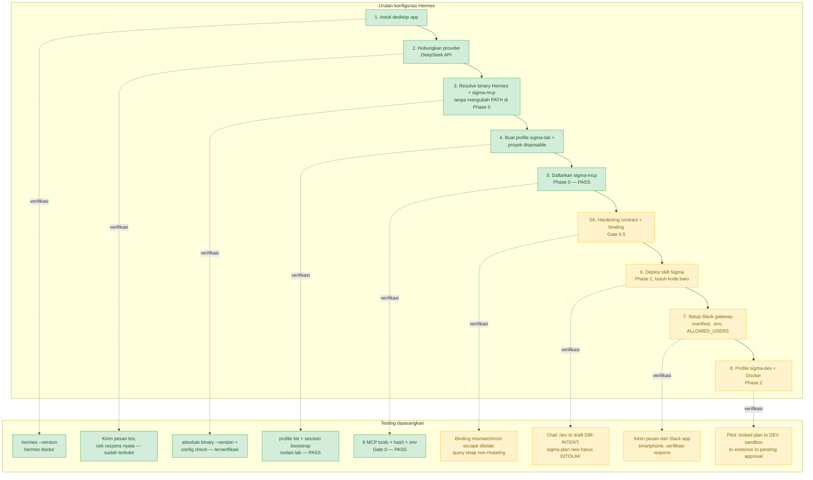

# Roadmap — Integrasi Sigma ↔ Hermes

**Status:** Phase 0 MCP **PASS** pada 2026-09-15; Gate 0.5 MCP hardening, Phase 1–4, dan Slack belum dieksekusi. Peta ini bukan artefak governance Sigma dan tidak mengotorisasi fase berikutnya.

Dua diagram:

1. **§1 — Peta fase pengembangan** (roadmap integrasi Sigma ↔ Hermes, Phase 0–4).
2. **§2 — Urutan konfigurasi Hermes + testing yang dipasangkan** (bagaimana tiap langkah config diverifikasi).

---

## 1. Peta fase pengembangan integrasi

```mermaid
flowchart TD
    Start(["Mulai"]) --> D0{{"Baseline disetujui:\nprofile sigma-lab +\nproyek disposable"}}
    D0 --> P0

    subgraph P0["PHASE 0 — Read-Only Orientation Lab"]
        direction TB
        P0a["Daftarkan sigma-mcp\ndi config.yaml"]
        P0b["Restart Hermes"]
        P0c["Cek nama tool asli\n(hermes tools)"]
        P0d["Bandingkan vs\nsigma session bootstrap manual"]
        P0a --> P0b --> P0c --> P0d
    end

    P0 --> G0{"Gate 0 lolos?\nMCP read-only terbukti,\nnol jalur tulis governance"}
    G0 -- "belum" --> P0
    G0 -- "lolos" --> P05

    subgraph P05["GATE 0.5 — MCP Contract + Binding Hardening"]
        direction TB
        P05a["Binding canonical root + project_id\nditegakkan server-side"]
        P05b["Response contract versioned +\nstate revision"]
        P05c["Cross-project dan root escape\nditolak"]
        P05a --> P05b --> P05c
    end

    P05 --> G05{"Gate 0.5 lolos?\nquery tetap non-mutating,\nbinding tidak dapat dipindah model"}
    G05 -- "belum" --> P05
    G05 -- "lolos" --> P1

    subgraph P1["PHASE 1 — Skills + Project Binding"]
        direction TB
        P1a["Kode: setup.ts + detect.ts\n(ROLE_FILES, targetDirMap, dst)"]
        P1b["setup/targets/hermes/*/SKILL.md"]
        P1c["Bridge stub HERMES.md baru"]
        P1d["Uji: skill ARC to draft DIR-INTENT"]
        P1e["Uji: sigma plan new DITOLAK\nsebelum ratify"]
        P1a --> P1b --> P1c --> P1d --> P1e
    end

    P1 --> G1{"Gate 1 lolos?\nrole immutability terjaga,\nplan new tertahan"}
    G1 -- "belum" --> P1
    G1 -- "lolos" --> P2

    subgraph P2["PHASE 2 — DEV Sandbox (belum di-plan rinci)"]
        direction TB
        P2a["Profile sigma-dev terpisah\nDocker + worktree"]
        P2b["Satu pilot: locked plan\nto DEV sandbox to evidence"]
        P2a --> P2b
    end

    P2 --> G2{"Gate 2 lolos?\nsource berubah hanya di worktree,\nsatu penulis progress.json"}
    G2 -- "belum" --> P2
    G2 -- "lolos" --> P3

    subgraph P3["PHASE 3 — Mailbox Dispatcher (belum di-plan rinci)"]
        direction TB
        P3a["Skema baru:\nUNREAD to CLAIMED to READ"]
        P3b["Dispatcher tidak menandai\nREAD saat polling"]
        P3a --> P3b
    end

    P3 --> G3{"Gate 3 lolos?\nclaim/lease cegah\naktivasi ganda"}
    G3 -- "belum" --> P3
    G3 -- "lolos" --> P4

    subgraph P4["PHASE 4 — Delegasi Specialist (belum di-plan rinci)"]
        direction TB
        P4a["Claude Code claude -p to DEV"]
        P4b["Codex codex exec to AUD/backup"]
        P4a --> P4b
    end

    P4 --> G4{"Gate 4 lolos?\noutput specialist diverifikasi,\ntanpa delegated push/publish"}
    G4 -- "lolos" --> Done(["Pipeline otonom penuh\nDirector hanya approve"])

    subgraph SLACK["Track paralel — Slack Gateway (mulai sejak Phase 0)"]
        direction TB
        Sa["hermes slack manifest --agent-view --write"]
        Sb["Install app di Slack workspace"]
        Sc["Isi .env: SLACK_BOT_TOKEN,\nSLACK_ALLOWED_USERS"]
        Sd["hermes gateway run (uji foreground)"]
        Se["hermes gateway install\nBELUM TERVERIFIKASI di Windows"]
        Sa --> Sb --> Sc --> Sd --> Se
    end

    P0 -. paralel .-> SLACK
    G05 -. "prasyarat capability Sigma di gateway" .-> SLACK
```

**Rujukan tiap node ke dokumen detail:**

| Fase di diagram | File rinci |
|---|---|
| Phase 0 | `PLAN-IMPL-HERMES-PHASE0-MCP-ORIENTATION-20260915.md` |
| Gate 0.5 + MCP query/command track | `../sigma-mcp/PLAN-IMPL-SIGMA-MCP-QUERY-COMMAND-PLANE-20260915.md` |
| Phase 1 | `PLAN-IMPL-HERMES-PHASE1-SKILLS-AND-BINDING-20260915.md` |
| Phase 2–4, Slack | `../../Discussion/2026-09-15_proposal-hermes-sigma-integration-setup-guide.md` (belum ada PLAN-IMPL — lihat `README.md` §"Kenapa hanya Phase 0/1") |

---

## 2. Konfigurasi Hermes + testing yang dipasangkan

Status warna mencerminkan kondisi **saat ini** (2026-09-15, terverifikasi langsung ke mesin) — bukan rencana ideal. Hijau = sudah terbukti jalan, kuning = langkah jelas tapi belum dikerjakan, merah = masih perlu keputusan Director sebelum bisa dikerjakan.

**Legenda:**

| Warna | Arti |
|---|---|
| 🟩 Hijau | Sudah dikerjakan dan diverifikasi langsung dalam sesi ini |
| 🟨 Kuning | Langkah jelas (command/cara sudah dikonfirmasi), belum dikerjakan |
| 🟥 Merah | Terhambat keputusan Director yang masih terbuka — lihat bagian "Keputusan Director yang masih terbuka" di tiap `PLAN-IMPL-*.md` |

**Catatan pembacaan diagram:** langkah 3–8 sengaja digambar linear untuk keterbacaan. Profile dan proyek disposable langkah 4 sudah dibuat serta dipakai ketika Gate 0 lulus pada 2026-09-15. Track Slack (langkah 7) dapat disiapkan/diuji tanpa Sigma secara paralel dan **bukan** bagian Gate 0; gateway baru boleh memperoleh capability Sigma setelah Gate 0.5 lulus—lihat diagram §1.
