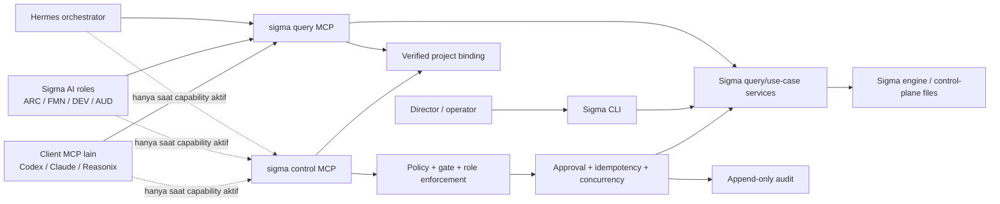

# PLAN-IMPL — Sigma MCP Query/Command Plane

**Sumber**: Temuan Hermes Phase 0 pada `../hermes/RESULT-HERMES-PHASE0-MCP-ORIENTATION-20260915.md` dan keputusan arsitektur sesi Director 2026-09-15 bahwa operasi Sigma layak diekspos sebagai primitive MCP bagi seluruh AI role/orchestrator, termasuk write, selama availability dan authority tetap dipisahkan.
**Tanggal**: 2026-09-15  
**Status**: **APPROVED (Batch 1) — Director menyetujui eksekusi Batch 1 pada 2026-09-15 beserta keputusan Q1–Q6 di §21.1.** Batch 2/3 (Stage C/D/E) tetap menunggu perintah terpisah. Bukan FMN-PLAN Sigma dan tidak memiliki otoritas lock/gate Sigma.  
**Relasi fase**: Plan platform lintas-consumer. Dalam roadmap Hermes, Increment A berfungsi sebagai **Gate 0.5** sebelum gateway diberi capability Sigma, multi-project routing, atau capability luas. Increment B–D juga melayani Sigma AI role dan client MCP lain.  
**Cakupan perubahan kode Sigma**: **Ya.** `src/mcp/*`, entry point/package, service layer writer, audit/approval primitive, konfigurasi MCP, dan test terkait.

---

## 1. Keputusan arah

Sigma akan mengarah ke interface MCP yang mencakup query dan command. MCP dipilih karena schema terstruktur, hasil machine-readable, validasi parameter, observability, dan capability filtering lebih aman daripada memberi AI role/orchestrator shell generik untuk operasi governance.

Keputusan ini **tidak** berarti seluruh tool write selalu tersedia bagi model.

> Semua operasi Sigma boleh mempunyai primitive MCP, tetapi hanya primitive yang sah untuk project binding, role, gate, channel, dan approval saat itu yang boleh tersedia dan berhasil dieksekusi.

`sigma-mcp` read-only yang sudah lulus Phase 0 tetap menjadi baseline. Write tidak ditambahkan ke surface read-only yang selalu aktif tanpa control boundary baru.

## 2. Masalah yang diselesaikan

Enam tool Phase 0 cukup untuk orientasi satu proyek, tetapi belum cukup sebagai interface bersama bagi AI role, orchestrator, dan client MCP lain:

1. `resolveRoot()` masih menerima beberapa sumber root—parameter tool, environment, CLI args, client roots, dan `cwd`—tanpa binding project ID yang ditegakkan server.
2. Respons canonical masih berupa JSON yang diserialisasi ke text; belum ada kontrak versi dan `structuredContent` yang seragam.
3. `next_valid_operations` belum mengklasifikasikan authority, role, atau approval requirement.
4. Artifact hanya tersedia sebagai tracker summary; role belum dapat membaca atau memperbarui DRAFT secara bounded tanpa filesystem tool umum.
5. Mailbox baru tersedia sebagai unread count.
6. Registry operasi mendefinisikan operasi `director`, tetapi Sigma belum memiliki authentication/approval record durable; role masih ditegakkan berdasarkan disiplin/convention. Terverifikasi 2026-09-15: `SIGMA-OPERATION-REGISTRY.json` berisi 59 operasi dengan dimensi role hanya `any` (47) dan `director` (12), serta level `semantic` (33) / `read_only` (23) / `system` (3). Tidak ada atribusi ARC/FMN/DEV/AUD per operasi, sehingga capability matrix Stage 0 **menciptakan** dimensi authority baru, bukan sekadar mengklasifikasi ulang data yang sudah ada.
7. CLI handler dan MCP berisiko drift bila command MCP mengimplementasikan mutation logic sendiri.

Plan ini menutup gap tersebut tanpa menjadikan Hermes, AI role, model provider, atau client MCP mana pun sebagai sumber otoritas governance.

## 3. Tujuan

1. Mengikat setiap sesi MCP Sigma ke satu canonical project root dan project ID yang terverifikasi.
2. Menetapkan kontrak respons versioned dan konsisten untuk semua consumer MCP.
3. Menambah query yang dibutuhkan role tanpa membuka arbitrary filesystem read.
4. Menyediakan command MCP sebagai primitive domain sempit, bukan generic shell/CLI bridge.
5. Menjamin setiap write tunduk pada role, gate, state revision, idempotency, audit, dan—bila diperlukan—approval Director durable.
6. Menjaga CLI dan MCP memakai use-case/service engine yang sama agar semantics tidak drift.
7. Membuat availability tool sebagai capability yang dapat dibatasi per runtime/profile/binding.
8. Menjadikan Sigma MCP consumer-neutral: Hermes adalah consumer pertama, bukan pemilik kontrak.

## 4. Non-goal

- Tidak memberi runtime/model mana pun sovereignty untuk ratify, lock, close, override, publish, atau mengubah policy.
- Tidak menganggap MCP annotation (`readOnlyHint`, `destructiveHint`) sebagai enforcement.
- Tidak membuat tool generik `sigma_execute_command`, `sigma_run_cli`, `sigma_read_file`, atau `sigma_write_file`.
- Tidak memindai semua proyek dari filesystem atau memory runtime.
- Tidak menjadikan chat, prompt, role argument, atau approval UI runtime sebagai approval governance Sigma.
- Tidak mengaktifkan push, deploy, Notion sync, credential management, setup host, atau doctor repair melalui control plane awal.
- Tidak mengganti sandbox/worktree untuk aktivitas DEV; MCP governance dan executor source tetap boundary berbeda.

## 5. Invarian arsitektur

1. **Protocol is not authority.** MCP hanya transport/interface; Sigma engine tetap memutuskan validity dan authority.
2. **One binding, one project.** Satu server/session bound tidak boleh berpindah project dari parameter tool.
3. **Role is server-derived.** Role tidak boleh dinaikkan dengan input model seperti `{ "role": "DIRECTOR" }`.
4. **Query is always non-mutating.** Query plane tidak menulis file, termasuk log operasi.
5. **Command is deny-by-default.** Tidak ada write tool yang aktif hanya karena implementasinya tersedia.
6. **No stale commit.** Write ditolak jika state/artifact berubah sejak preview atau pembacaan yang menjadi dasarnya.
7. **Exactly-once effect.** Retry dengan idempotency key yang sama tidak membuat efek ganda.
8. **Director finality.** Transisi sovereign/material membutuhkan approval record Sigma yang cocok dan belum kedaluwarsa/terpakai.
9. **Same use case, two adapters.** CLI dan MCP memanggil service yang sama; MCP tidak shell-out ke `sigma` dan tidak menduplikasi mutation logic.
10. **Audit without secrets.** Semua attempt/deny/commit tercatat, tetapi credential, payload D3, dan isi sensitif tidak disalin ke log.
11. **Consumer-neutral contract.** Schema, error, binding, policy, dan command semantics tidak boleh mengandung asumsi khusus Hermes/Codex/Claude/Reasonix.

## 6. Arsitektur target



### 6.1 Logical plane

| Plane | Availability | Isi | Mutasi |
|---|---|---|---|
| **Query** | Setelah binding; dapat selalu aktif pada profile Sigma | state, gate, orientation, artifact, policy, evidence, diagnosis | Tidak |
| **Bounded command** | Role/gate/profile scoped | membuat atau memperbarui DRAFT, memo, pesan, evidence | Ya, reversible/project-bound |
| **Governance transition** | Hanya dengan approval/policy yang cocok | ratify, lock, supersede, activate, close | Ya, lifecycle/material |
| **Privileged/system** | Disabled; manual atau profile khusus | override, repair, setup, sync host/external, credential | Ya, berisiko tinggi |

Implementasi boleh memakai satu codebase/binary, tetapi setiap consumer harus melihat logical server/capability yang terpisah. Baseline yang direkomendasikan:

- `sigma` — query plane, mempertahankan kompatibilitas konfigurasi existing tanpa mengubah enam nama tool.
- `sigma-control` — command plane, tidak dipasang secara global/default dan hanya diluncurkan untuk binding/role yang memenuhi policy.

### 6.2 Consumer dan pembagian kerja

| Consumer | MCP governance | Tool non-governance yang tetap diperlukan |
|---|---|---|
| **ARC** | verify binding, baca state/intent/policy, create/update DIR-INTENT DRAFT | Percakapan/interview Director |
| **FMN** | baca RATIFIED intent, create/update plan DRAFT, preflight transition | Analisis teknis/repository read sesuai mandat |
| **DEV** | baca LOCKED plan, create/update exec/evidence, handoff | Sandbox filesystem, build, test, dan scoped Git |
| **AUD** | baca artifact/evidence/hash/policy, record finding bila dimandatkan | Tool audit eksternal yang read-only dan scoped |
| **Hermes** | orientasi, routing, policy view, monitoring, dan command yang didelegasikan | Session/channel/scheduler/sandbox orchestration |
| **Director/operator** | Dapat memakai MCP client, tetapi CLI tetap trusted manual/recovery surface | Terminal lokal untuk bootstrap, approval, dan emergency recovery |

MCP adalah jalur utama operasi governance agent (**MCP-first**), bukan satu-satunya interface (**bukan MCP-only**). Shell tetap digunakan untuk pekerjaan teknis seperti edit source/build/test di sandbox; shell generik tidak menjadi jalan pintas untuk governance yang sudah mempunyai primitive MCP.

## 7. Kontrak binding

### 7.1 Startup binding

Server menerima canonical project root melalui argument proses/config tepercaya. **Dua bentuk argumen didukung** (keputusan Q1, §21.1): bentuk posisional dipertahankan karena seluruh config MCP yang sudah terpasang memakainya — `src/utils/mcpConfig.ts` menulis `{ command: "sigma-mcp", args: [projectRoot] }`, tanpa flag dan tanpa project ID.

```text
# Bentuk lama (kompatibilitas) — dihasilkan mcpConfig.ts sebelum Stage A
sigma-mcp <ABS_ROOT>

# Bentuk binding terverifikasi — dihasilkan mcpConfig.ts sejak Stage A
sigma-mcp --mode query --project-root <ABS_ROOT> --project-id <EXPECTED_ID>
sigma-mcp --mode control --project-root <ABS_ROOT> --project-id <EXPECTED_ID> --role <BOUND_ROLE>
```

Parsing argumen dilakukan di **startup entry point**, bukan di dalam resolver per-call. Kondisi awal: `bin/sigma-mcp.js` tidak mem-parse `argv` sama sekali, dan `argv` hanya dibaca di dalam `resolveRoot()` sebagai salah satu dari lima kandidat.

Aturan:

1. Resolve real/canonical path satu kali pada startup, termasuk normalisasi case/separator Windows serta junction/symlink.
2. Baca `.sigma-identity.json`; bila `--project-id` diberikan, `project_id` harus sama dengan expected ID.
3. Root harus memiliki struktur Sigma yang valid.
4. `project_root` per-call dihapus dari tool baru. Pada enam tool lama, parameter itu hanya diterima untuk kompatibilitas dan harus kosong atau canonical-equal dengan bound root.
5. Mismatch menghasilkan `BOUNDARY_VIOLATION`; setelah binding terbentuk, server tidak fallback ke `cwd`, environment lain, atau client roots.
6. **Bound tanpa verifikasi identity**: root diberikan (posisional atau `--project-root`) tanpa `--project-id`. Binding tetap mengunci root dan tetap menolak cross-project call, tetapi melaporkan `binding_verified:false` karena klaim project ID tidak pernah diperiksa.
7. **Discovery mode**: tidak ada root sama sekali. Server memakai `resolveRoot()` legacy dan melaporkan `binding_verified:false`. Mode ini dipertahankan satu rilis untuk client yang belum di-sync; control mode wajib menolak startup tanpa binding penuh.
8. Seluruh AI role/orchestrator wajib memakai required-binding mode. Discovery mode dan bound-tanpa-verifikasi tidak boleh memperoleh command capability.

### 7.2 Binding metadata

Setiap respons membawa metadata minimum:

```json
{
  "contract_version": "1.0",
  "tool": "sigma_get_state",
  "binding": {
    "verified": true,
    "project_id": "HERMESLAB",
    "root_fingerprint": "sha256:..."
  },
  "snapshot": {
    "active_chain": "v1",
    "state_revision": "sha256:...",
    "observed_at": "2026-09-15T00:00:00.000Z"
  },
  "source": "engine"
}
```

Absolute root tidak perlu dikirim ke model secara default. `root_fingerprint` cukup untuk correlation; diagnostic path hanya tersedia pada local trusted surface.

### 7.3 State revision

`state_revision` dihitung deterministik dari bytes tiga file, disebut dengan konstanta aktualnya di `src/config.ts`:

| Input | Konstanta | Path |
|---|---|---|
| Identity | `PROJECT_IDENTITY_FILE` | `.sigma-identity.json` |
| Pointer active chain | `ACTIVATE_STATUS_FILE` | `Sigma/activate_status.json` |
| Chain aktif | — | `Sigma/progress-v<N>.json`, `<N>` dari `activate_status.json` |

Command yang menyentuh artifact juga membutuhkan `expected_artifact_sha256`.

Yang **tidak** masuk perhitungan: `Sigma/logs/operations.jsonl`, `Sigma/memory/overrides.jsonl`, mailbox index, dan — secara eksplisit — idempotency/approval store Stage C/D di mana pun ia nanti disimpan (keputusan Q6, §21.1). Store tersebut tidak boleh memperturbasi `state_revision`, karena kalau ya, setiap write akan meng-invalidasi ticket-nya sendiri.

Perubahan salah satu input setelah prepare/read harus menyebabkan `STALE_STATE` atau `STALE_ARTIFACT`, bukan silent overwrite.

### 7.4 Matriks kompatibilitas config × binary

Seluruh config MCP yang sudah terpasang — `.mcp.json`, `.cursor/mcp.json`, config Codex, Antigravity, Reasonix, termasuk **config global** Codex/Gemini (lihat caveat Phase 0 §5.2) — membawa bentuk posisional. Stage A wajib lulus keempat sel berikut:

| | Binary lama (pra-Stage A) | Binary baru (Stage A) |
|---|---|---|
| **Config lama** (`args: [root]`) | Baseline Phase 0; `binding_verified` tidak ada | Bound, `binding_verified:false`, root terkunci, cross-project ditolak |
| **Config baru** (`--project-root` + `--project-id`) | Flag tak dikenal jatuh ke `resolveRoot()` argv scan; harus tetap menemukan root, tidak boleh crash | Bound penuh, `binding_verified:true` |

Sel kiri-bawah adalah alasan bentuk flag harus tetap ter-resolve oleh scanner argv lama: Director dapat men-`sync` config sebelum binary global diperbarui.

Migrasi bersifat **opt-in melalui `sigma project sync`**, bukan otomatis. Batch 1 mengubah writer `mcpConfig.ts` tetapi tidak menjalankan `project start`/`project sync` terhadap proyek nyata mana pun (keputusan Q2, §21.1); verifikasi hanya melalui fixture disposable.

## 8. Kontrak respons dan error

1. Pertahankan enam nama tool existing agar client tidak putus.
2. Tambahkan metadata secara additive pada payload existing.
3. `structuredContent` menjadi bentuk canonical dan text JSON tetap diberikan sebagai compatibility representation. Terverifikasi 2026-09-15: SDK `@modelcontextprotocol/sdk@1.29.0` yang terinstal sudah mengekspos `structuredContent`/`outputSchema` pada `server/mcp.d.ts` dan `client/index.d.ts`, jadi ini bukan lagi kondisional — test spike tetap wajib, tetapi sebagai bukti perilaku, bukan sebagai penentu arah.
4. Seluruh error memakai code stabil, minimal:

```text
NO_PROJECT
BINDING_REQUIRED
BOUNDARY_VIOLATION
PROJECT_ID_MISMATCH
ROLE_NOT_AUTHORIZED
GATE_BLOCKED
APPROVAL_REQUIRED
APPROVAL_MISMATCH
STALE_STATE
STALE_ARTIFACT
IDEMPOTENCY_CONFLICT
PAYLOAD_TOO_LARGE
INVALID_OPERATION
INTERNAL_ERROR
```

5. Pesan error tidak membocorkan environment, credential, arbitrary host path, atau stack trace ke model.

### 8.1 Host path pada payload existing

`sigma_get_memory` saat ini mengembalikan `source_path` berisi path host absolut. Aturan additive-only (butir 2) dan larangan kebocoran host path (§16.2) tidak dapat dipenuhi bersamaan tanpa keputusan eksplisit.

Resolusi (keputusan Q3, §21.1): redaksi **terikat pada state binding, bukan pada versi binary**.

| Kondisi | `source_path` |
|---|---|
| `binding_verified:false` (discovery / bound-tanpa-verifikasi) | Tetap absolut — perilaku client lama tidak berubah |
| `binding_verified:true` | Relatif terhadap bound root, ditambah `source_path_fingerprint` |

Karena `binding_verified:true` hanya mungkin pada config yang sudah di-sync ke bentuk flag, tidak ada client existing yang berubah perilakunya tanpa tindakan Director. `contract_version` naik ketika bentuk redaksi ini aktif.

## 9. Tool surface target

### 9.1 Query plane

Enam tool Phase 0 dipertahankan:

- `sigma_get_state`
- `sigma_get_orientation`
- `sigma_get_gates`
- `sigma_list_artifacts`
- `sigma_doctor`
- `sigma_get_memory`

Tool tambahan prioritas:

| Tool | Fungsi | Constraint utama |
|---|---|---|
| `sigma_verify_binding` | Verifikasi expected project/root terhadap binding server | Tidak mencari project lain |
| `sigma_get_effective_policy` | Klasifikasi operasi sebagai observe, role-action, Director-required, gate-blocked, atau forbidden | Output advisory; enforcement tetap server-side |
| `sigma_read_artifact` | Membaca artifact governance berdasarkan type/version | Allowlist path dari chain tracker; size cap; hash/certification state |
| `sigma_list_messages` | Metadata mailbox role tanpa mengubah status | Tidak menandai `READ` |
| `sigma_read_message` | Membaca satu pesan yang telah diotorisasi | Tidak mengubah status; project/role scoped |
| `sigma_get_evidence` | Membaca evidence reference/status untuk plan/exec tertentu | Tidak arbitrary log read |

`sigma_read_artifact` tidak menerima filesystem path bebas. Server menyelesaikan path hanya dari artifact tracker/registry dan menolak traversal, symlink escape, artifact yang tidak sesuai role, serta payload melebihi limit.

**Konflik semantik yang harus diselesaikan sebelum B2.** `sigma_read_message` di atas dispesifikasikan non-mutating, sedangkan CLI `sigma inbox read` menandai pesan `READ` (`src/commands/inbox.ts:93`) **dan** menyapu surplus `READ` → `OUTDATED` (`src/commands/inbox.ts:105`). Dua adapter atas use-case yang sama akan menghasilkan post-state berbeda — persis kriteria berhenti §22. Ini tidak boleh diselesaikan dengan memberi nama berbeda pada tool; B2 wajib memilih salah satu secara sadar:

- memisahkan use-case `message_peek` (non-mutating) dari `message_read` (menandai `READ`) di service layer, lalu CLI dan MCP sama-sama memakai keduanya; **atau**
- `sigma_read_message` ikut menandai `READ`, sehingga ia bukan query dan pindah ke command plane.

Keputusan ini bagian dari Stage B2 dan tidak dibekukan pada Batch 1.

### 9.2 Bounded command plane

Pilot awal:

| Tool | Efek | Required control |
|---|---|---|
| `sigma_create_intent_draft` | Membuat template DIR-INTENT DRAFT | ARC binding; idempotency |
| `sigma_create_plan_draft` | Membuat FMN-PLAN DRAFT | FMN binding; Gate 1; intent ref |
| `sigma_create_exec_draft` | Membuat DEV-EXEC DRAFT | DEV binding; Gate 2; plan ref |
| `sigma_update_artifact_draft` | Mengganti isi artifact DRAFT yang sudah terdaftar | Role owner; expected artifact hash; size cap; atomic write |
| `sigma_write_memo` | Menulis memo self-to-self | Bound role; mailbox limits |
| `sigma_send_message` | Mengirim handoff/message formal | Sender role berasal dari binding; receiver allowlist |
| `sigma_record_evidence` | Mencatat evidence terstruktur | Plan/exec ref; hash; no arbitrary host attachment |

Nama final harus mengikuti vocabulary registry/CLI dan dapat disesuaikan pada inventory Stage 0. Tidak ada tool yang boleh menerima `from_role`, root, atau target file arbitrary dari model.

### 9.3 Governance transition plane

Transisi berikut memakai primitive typed, bukan generic executor:

- intent ratify/amend/supersede/activate;
- plan lock/supersede/promote;
- exec lock/supersede;
- close create/lock;
- mailbox claim/ack setelah skema claim/lease selesai.

**Roadmap tidak punya transisi lock tersendiri.** Terverifikasi 2026-09-15: registry tidak memuat operasi `roadmap_lock` — hanya `roadmap_new`, `roadmap_list`, `roadmap_render`, `roadmap_check`. Roadmap menjadi `LOCKED` semata-mata sebagai **efek samping `sigma close lock`** (`src/commands/roadmap.ts:22-25`). Karena itu tidak ada primitive `sigma_lock_roadmap`; efeknya terikat pada commit `close_lock` dan harus muncul di `effects[]` operation ticket close, bukan sebagai operasi terpisah.

Setiap transisi material memakai dua tahap:

```text
typed prepare → durable Director approval → typed commit
```

`prepare` bersifat read-only dan menghasilkan operation ticket. `commit` hanya menerima ticket + approval reference + idempotency key; arguments material tidak boleh diam-diam berubah pada commit.

### 9.4 Privileged/system operations

Operasi berikut tidak masuk control plane awal:

- override;
- doctor repair/reconstruct;
- project start/register/sync;
- setup install/uninstall;
- credential/config host;
- Notion/external synchronization;
- Git push/publish/deploy;
- destructive cleanup.

Masing-masing membutuhkan threat model dan plan terpisah. Memiliki entri di operation registry tidak otomatis membuatnya admissible untuk AI role/orchestrator.

## 10. Operation ticket dan approval record

### 10.1 Operation ticket

Prepare menghasilkan record canonical:

```json
{
  "operation_id": "plan_lock",
  "operation_ticket_id": "op_...",
  "project_id": "ABC",
  "bound_role": "FMN",
  "arguments_hash": "sha256:...",
  "target": { "artifact": "FMN-PLAN", "version": "v2", "sha256": "sha256:..." },
  "expected_state_revision": "sha256:...",
  "effects": [],
  "authority": "director",
  "expires_at": "..."
}
```

Ticket tidak memberikan authority; ia hanya membekukan intent operasi dan kondisi awal.

### 10.2 Durable approval

Approval Sigma minimal mengikat:

- approval ID;
- project ID;
- operation ticket ID dan operation ID;
- arguments hash;
- target artifact version/content hash;
- expected state revision;
- keputusan approve/reject;
- identitas Director dan authentication method;
- channel/surface asal keputusan;
- issued/expiry/consumed timestamps.

Pilot menggunakan approval yang direkam melalui trusted local CLI Director. Approval dari chat/runtime UI saja tidak sah. Remote Director authentication menjadi plan terpisah sebelum gateway boleh commit W2.

Approval harus single-use. Ticket yang expired, sudah consumed, berubah target/hash, atau state-nya stale ditolak.

## 11. Idempotency, concurrency, dan atomicity

1. Semua write membutuhkan `idempotency_key` scoped ke project + operation + actor/binding.
2. Server menyimpan outcome pertama dan mengembalikan outcome yang sama pada retry identik.
3. Key sama dengan arguments hash berbeda menghasilkan `IDEMPOTENCY_CONFLICT`.
4. Commit memegang project-scoped lock selama compare-and-write.
5. Gunakan temp file + atomic replace untuk state/artifact bila didukung platform. Sebagian sudah tersedia: `writeChain` (`src/engine/chain.ts:511-520`), `writeActivateStatus` (`src/engine/chain.ts:352-358`), dan `writeJsonSafe` (`src/utils/mcpConfig.ts`) sudah memakai tmp+rename, termasuk penanganan file Hidden pada Windows. Stage C mewarisi pola ini, bukan membuatnya baru.
6. Artifact dan chain state harus dianggap satu transaction boundary; kegagalan parsial wajib terdeteksi dan direkonsiliasi, bukan dilaporkan sukses.
7. Dua worker yang mencoba ticket sama: paling banyak satu berhasil; lainnya menerima consumed/stale result.

## 12. Policy dan availability

`sigma_get_effective_policy` memproyeksikan policy, tetapi enforcement dilakukan lagi di setiap command. Minimum input enforcement berasal dari:

- verified binding;
- server-bound role/profile;
- lifecycle/gate aktual;
- operation registry;
- channel/action tier policy;
- artifact owner/state;
- approval requirement;
- state revision dan artifact hash.

Tool registration/allowlist dibatasi sekecil mungkin. Bila suatu consumer belum mendukung dynamic tool-list refresh dengan andal, gunakan profile/server configuration terpisah dan mulai sesi baru ketika capability berubah. Server tetap wajib menolak command yang tidak sah walaupun tool lama masih terlihat karena cache.

## 13. Service-layer rule

Sebelum menambah command MCP, mutation logic di CLI terkait diekstrak menjadi use-case service yang:

- tidak bergantung pada Commander, prompt interaktif, atau `console.log`;
- menerima typed input dan actor/context;
- menjalankan validation/gate enforcement;
- mengembalikan typed result/effects;
- menjadi satu-satunya jalur yang dipakai CLI dan MCP;
- mempunyai unit test langsung.

MCP tidak menjalankan subprocess `sigma`, tidak memanggil Commander handler, dan tidak menulis state langsung dari tool adapter.

## 14. Tahapan implementasi

### Stage 0 — Inventory dan contract freeze

1. Klasifikasikan seluruh operasi di `SIGMA-OPERATION-REGISTRY.json` menjadi Query, W1 Bounded, W2 Governance, atau W3 Privileged.
2. Tandai mismatch registry vs implementasi aktual; registry bukan bukti bahwa primitive sudah aman.
3. Bekukan response envelope, error codes, state revision, size limits, dan canonical path rules.
4. Verifikasi dukungan `structuredContent` SDK, in-process test client, dan sekurang-kurangnya consumer aktual pertama (Hermes).

**Output**: operation capability matrix + contract test fixtures.

### Stage A — Gate 0.5: Query contract dan binding hardening

1. Tambah binding resolver server-side dan root fingerprint.
2. Tambah response metadata/structured content tanpa mengganti enam nama tool.
3. Tambah `sigma_verify_binding`.
4. Tolak cross-project call dan control startup unbound.
5. Pertahankan non-mutation query.

**Gate 0.5 PASS bila** reference client dan Hermes membaca state yang sama, binding verified, root lain ditolak, seluruh query nol mutasi, credential probe tetap lulus, dan compatibility test lulus.

Stage A adalah prasyarat sebelum gateway memperoleh capability Sigma, sebelum multi-project routing, dan sebelum control MCP. Setup/uji channel tanpa Sigma boleh tetap berjalan paralel. Stage A tidak harus memblokir eksperimen skill Phase 1 yang tetap berada di `sigma-lab` tanpa write capability.

### Stage B — Query expansion untuk role

1. **B1 wajib pada Batch 1:** tambah `sigma_get_effective_policy`.
2. **B1 wajib pada Batch 1:** tambah bounded `sigma_read_artifact`.
3. **B2 deferred:** tambah evidence view saat kontrak evidence consumer tersedia.
4. **B2 deferred:** tambah mailbox metadata/read saat desain claim/lease dan role visibility siap.

**Gate B1 PASS bila** role memperoleh policy dan artifact minimum yang sama dengan sumber Sigma, tidak dapat membaca arbitrary path/project/role, dan semua query nol mutasi. B2 tidak menjadi syarat Batch 1.

### Stage C — Bounded command pilot

1. Buat entry point/logical server `sigma-control` yang disabled by default.
2. Ekstrak service bersama dari CLI untuk primitive pilot.
3. Implementasikan idempotency, compare-and-write, audit, dan atomic failure handling.
4. Pilot satu lifecycle sempit: create + update DRAFT pada proyek disposable.
5. Tambah memo/message/evidence hanya setelah pilot DRAFT lulus.

**Gate C PASS bila** write hanya terjadi pada bound project/artifact DRAFT, role/gate mismatch ditolak, retry tidak menggandakan efek, stale write ditolak, query server tetap tidak mempunyai write imports/tool.

### Stage D — Governance transition pilot

1. Implementasikan operation ticket.
2. Implementasikan approval record durable via trusted local Director CLI.
3. Pilot satu transisi, direkomendasikan `intent_ratify`, melalui prepare → approve → commit.
4. Uji approval mismatch, expiry, replay, concurrent commit, dan crash recovery.
5. Baru setelah gate lulus, tambah transisi typed lain satu per satu.

**Gate D PASS bila** tidak ada transisi tanpa approval valid, ticket terikat hash/state, approval single-use, audit lengkap, dan semantics identik antara CLI dan MCP.

### Stage E — Registry parity bertahap

1. Tambahkan primitive berdasarkan kebutuhan nyata, bukan mengejar jumlah tool.
2. Setiap primitive membutuhkan owner, tier, schema, test contract, rollback, dan policy availability.
3. W3 tetap deferred sampai plan keamanan tersendiri disetujui.

## 15. Perubahan file yang diproyeksikan

Nama final dapat berubah setelah Stage 0, tetapi boundary berikut direkomendasikan:

| Area | Perubahan |
|---|---|
| `src/mcp/shared.ts` | Ganti resolver longgar dengan binding-aware request context; standard envelope/error |
| `src/mcp/index.ts` | Query server registration dan startup binding |
| `src/mcp/binding.ts` | Canonical root, identity verification, fingerprint |
| `src/mcp/contract.ts` | Contract version, metadata, error codes, structured response |
| `src/mcp/policy.ts` | Projection policy dan reusable enforcement input |
| `src/mcp/tools/*` | Query baru dan migrasi enam tool existing |
| `src/mcp/control/*` | Command adapters dan registration terpisah |
| `src/services/*` | Use-case bersama CLI/MCP; tidak transport-specific |
| `src/engine/*` | Approval, idempotency, locking/audit primitives bila belum tersedia |
| `bin/sigma-mcp.js` | Parsing `argv` binding di entry point — saat ini file ini tidak membaca `argv` sama sekali dan hanya memanggil `startMcpServer()` |
| `bin/` + `package.json` | Entry point control plane jika dipisah executable |
| `src/utils/mcpConfig.ts` | Project-bound query config; control tidak auto-install |
| `test/mcp-*.test.ts` | Contract, binding, policy, non-mutation, transport |
| `test/control-mcp-*.test.ts` | Authorization, stale state, idempotency, concurrency, approval |

## 16. Test contract minimum

### 16.1 Binding dan isolation

- Canonical bound root dan expected project ID cocok → berhasil.
- Project ID mismatch → gagal tertutup.
- Per-call root berbeda → `BOUNDARY_VIOLATION`.
- Relative path, case variation, `..`, symlink, dan Windows junction tidak dapat escape.
- `cwd`, environment, client roots, atau prompt tidak dapat mengganti binding.
- Dua server untuk dua proyek tidak berbagi state, cache, ticket, atau idempotency record.

### 16.2 Query safety

- Seluruh query menghasilkan hash governance before/after identik.
- Query tidak mengimpor writer dan tidak menulis operations log. Guard statis ini **sudah ada** di `test/mcp-tools.test.ts` dan wajib diperluas agar mencakup tool query baru, bukan ditulis ulang.
- Artifact reader hanya membaca tracker-owned path dan menerapkan size limit.
- Memory/path output tidak membocorkan host path yang tidak diperlukan.
- Text JSON dan `structuredContent` membawa fakta yang identik.

### 16.3 Command safety

- Query profile tidak mendaftarkan command tool.
- Control unbound tidak dapat start.
- Role input spoofing tidak mengubah bound role.
- Gate/owner/state mismatch ditolak sebelum write.
- Expected state/artifact hash mismatch ditolak.
- Retry identik menghasilkan satu efek.
- Retry key sama dengan payload berbeda ditolak.
- Concurrent commit menghasilkan paling banyak satu success.
- Failure di tengah operasi tidak meninggalkan success palsu atau state setengah jadi.

### 16.4 Approval

- Chat confirmation tanpa Sigma approval record ditolak.
- Approval project/operation/argument/artifact/hash berbeda ditolak.
- Approval expired/rejected/consumed ditolak.
- Satu approval tidak dapat dipakai lintas proyek atau lintas transisi.
- Successful commit menandai approval consumed dan menulis audit correlation.

### 16.5 Consumer compatibility dan runtime Hermes

- In-process reference client memverifikasi schema dan error contract canonical.
- Sekurang-kurangnya satu consumer aktual (Hermes `sigma-lab`) memanggil seluruh query Batch 1.
- Tool administratif dan model-facing dicatat ulang setelah setiap surface berubah.
- Hermes profile `sigma-lab` hanya query pada Gate 0.5.
- Control pilot kelak memakai runtime/profile disposable terpisah.
- Prompt eksplisit untuk berpindah root, memalsukan role, mengulang commit, dan mengabaikan approval semuanya ditolak oleh server, bukan hanya model.
- Environment child tetap tidak menerima credential asing.

### 16.6 Regression

- `npm run build`
- `npm test` — baseline terverifikasi 2026-09-15 sebelum perubahan apa pun: **49 file / 487 test pass**, build `tsc` bersih. Delta setelah Batch 1 harus terukur terhadap angka ini; tidak boleh ada test yang hilang, hanya bertambah atau berubah dengan alasan yang didokumentasikan.
- existing six-tool integration test diperbarui tanpa kehilangan assertion `source: engine` dan non-mutation.
- CLI dan MCP untuk use case yang sama menghasilkan post-state identik pada fixture terpisah.
- Konfigurasi Codex/Reasonix/Antigravity existing tidak rusak; control server tidak dipasang otomatis.

## 17. Observability dan audit

Command audit minimal memuat:

```text
timestamp
correlation_id
project_id
binding_fingerprint
bound_role
channel/profile
operation_id
operation_ticket_id
approval_id (bila ada)
idempotency_key_hash
state_revision_before/after
artifact_hash_before/after
outcome/error_code
```

Jangan log credential, raw approval secret/signature, full prompt, D3 content, atau full artifact body. Query telemetry—bila diaktifkan—harus terpisah dari governance mutation log agar query tetap non-mutating terhadap project tree.

## 18. Rollout dan rollback

1. Enam query existing tetap default; tool baru masuk satu increment per gate.
2. `sigma-control` tidak auto-register pada setup dan tidak aktif pada konfigurasi global/default; khusus Hermes, ia tidak aktif pada `default`, `sigma-lab`, atau gateway.
3. Pilot selalu memakai proyek dan runtime/profile disposable tanpa secret atau remote.
4. Rollback Stage A/B: lepaskan versi query baru dari consumer dan kembalikan binary/config sebelumnya; governance state tidak perlu dipulihkan karena query non-mutating.
5. Rollback Stage C/D: disable/remove control server terlebih dahulu, hentikan worker, verifikasi audit dan state, lalu pulihkan hanya melalui primitive Sigma yang telah ditentukan—bukan edit manual progress file.
6. Setiap migration approval/idempotency store wajib mempunyai backup dan downgrade/read compatibility plan sebelum rollout.

## 19. Definition of Done plan keseluruhan

- [ ] Operation capability matrix seluruh registry selesai dan direview.
- [x] Query binding server-side lulus Gate 0.5 pada level contract **dan** runtime. Smoke test out-of-process terhadap lab `HERMESLAB` dijalankan 2026-09-15; bukti dan skrip reproducible di `RESULT-IMPL-SIGMA-MCP-BATCH1-20260915.md` §6 dan `evidence/gate05-runtime-smoke.mjs`.
- [ ] Response contract versioned, lulus reference client, dan runtime-tested di Hermes sebagai consumer pertama.
- [ ] Policy dan bounded artifact query lulus Gate B.
- [ ] Control server terpisah, disabled by default, dan W1 pilot lulus Gate C.
- [ ] Approval durable + satu W2 transition lulus Gate D.
- [ ] CLI dan MCP terbukti memakai service semantics yang sama.
- [ ] Cross-project, role spoof, stale state, replay, concurrency, dan crash tests lulus.
- [ ] Tidak ada credential leakage atau arbitrary file/shell primitive.
- [ ] Dokumentasi setup, threat boundary, roadmap, dan result evidence diperbarui.

## 20. Handoff implementasi untuk Claude Code

### 20.1 Pembagian tanggung jawab

| Pihak | Tanggung jawab |
|---|---|
| **Director** | Memberi perintah mulai, menerima/menolak hasil batch, dan memutuskan ekspansi authority |
| **Claude Code** | Implementer plan sesuai batch yang diotorisasi; menghasilkan code, test, evidence, dan result report |
| **Codex** | Reviewer independen setelah Director meminta review; tidak dianggap telah menyetujui implementasi hanya karena menulis plan |

### 20.2 Scope default perintah implementasi

Jika Director mengatakan “implementasikan plan perluasan MCP” tanpa perluasan scope lain, Claude Code mengerjakan **Batch 1 saja**:

1. Stage 0 — inventory/capability matrix dan contract freeze.
2. Stage A — binding hardening, response contract, `sigma_verify_binding`.
3. Stage B1 — `sigma_get_effective_policy` dan bounded `sigma_read_artifact`.
4. Dokumentasi, migration/compatibility notes, dan result evidence Batch 1.

Tidak termasuk Batch 1:

- `sigma-control` registration/activation;
- seluruh write tool;
- approval/idempotency persistent store;
- Stage B2 evidence/mailbox query;
- Stage C/D/E;
- perubahan profile/config Hermes di luar repository;
- perubahan global config Codex, Claude, Reasonix, Gemini, atau host;
- commit, push, publish, atau release.

Klarifikasi batas terhadap `src/utils/mcpConfig.ts` (keputusan Q2, §21.1): mengubah **kode writer**-nya termasuk Batch 1 karena §15 memasukkannya ke boundary perubahan. Yang dilarang adalah **menjalankan** writer itu terhadap sistem nyata — `sigma project start`, `sigma project sync`, atau apa pun yang menulis ke `~/.codex`, `~/.gemini`, `~/.reasonix`, atau config global lain. Kedua hal itu berbeda dan tidak boleh dicampur: caveat Phase 0 §5.2 membuktikan `project start` menyentuh config global, jadi perintah tersebut tidak dijalankan sama sekali selama Batch 1.

Stage C dan D memerlukan perintah Director terpisah setelah review batch sebelumnya. Membuat scaffolding/type yang tidak terekspos boleh dilakukan hanya bila diperlukan oleh kontrak Batch 1 dan tidak mendaftarkan tool write.

### 20.3 Aturan kerja implementer

1. Baca plan ini penuh serta evidence Hermes Phase 0 sebelum mengubah kode.
2. Perlakukan working tree existing sebagai milik Director; jangan menghapus atau menimpa perubahan unrelated.
3. Gunakan engine/query functions yang sama; jangan shell-out ke `sigma`.
4. Pertahankan enam nama tool dan compatibility kecuali test spike membuktikan perubahan wajib; deviasi harus didokumentasikan.
5. Jangan mengklaim dynamic tool refresh, `structuredContent`, symlink/junction safety, atau non-mutation tanpa test nyata.
6. Gunakan fixture disposable dan jangan menyentuh proyek produksi/registry global.
7. Hentikan pada kriteria §22 atau ketika keputusan baru dibutuhkan; jangan memperluas authority berdasarkan asumsi.

### 20.4 Deliverable wajib Batch 1

- perubahan source dan test yang scoped;
- `Implementation/sigma-mcp/SIGMA-MCP-OPERATION-CAPABILITY-MATRIX-20260915.md`, mencakup seluruh registry dengan status `implemented/deferred/not-admissible`;
- contract/schema dan compatibility notes;
- evidence `npm run build`, `npm test`, targeted MCP test, binding-negative test, dan governance before/after hash;
- matriks kompatibilitas §7.4 terbukti oleh test, bukan oleh argumen;
- runtime smoke test Hermes bila environment tersedia; bila tidak, tandai eksplisit sebagai belum terbukti dan jangan menyatakan Gate 0.5 PASS;
- `Implementation/sigma-mcp/RESULT-IMPL-SIGMA-MCP-BATCH1-<YYYYMMDD>.md` berisi hasil, deviasi, risiko, rollback, dan daftar file berubah;
- `git diff --check` bersih dan status working tree dilaporkan tanpa melakukan commit/push kecuali Director memerintahkan.

### 20.5 Paket review setelah implementasi

Saat Director meminta Codex mereview hasil Claude Code, input review minimum adalah source diff, seluruh test output, capability matrix, result report, dan runtime evidence. Review harus memeriksa correctness, scope fidelity, security boundary, compatibility, serta apakah klaim Gate 0.5/B1 benar-benar didukung evidence.

## 21. Keputusan Director

### 21.1 Diputuskan 2026-09-15 (mengikat Batch 1)

Director menyetujui eksekusi Batch 1 beserta enam keputusan berikut:

| # | Pertanyaan | Keputusan | Konsekuensi |
|---|---|---|---|
| Q1 | Bentuk argumen binding | Terima **dua bentuk** satu rilis: posisional (kompatibilitas, `binding_verified:false`) dan flag lengkap (`binding_verified:true`) | §7.1, §7.4. Flag-only akan memutus seluruh instalasi existing termasuk lab Hermes, sehingga Gate 0.5 tidak dapat dibuktikan |
| Q2 | Bolehkah Batch 1 mengubah `mcpConfig.ts` | **Ya**, ubah writer-nya; **tidak** menjalankan `project start`/`project sync` terhadap proyek nyata. Verifikasi lewat fixture disposable saja | Director menjalankan sync sendiri setelah review; config global Codex/Gemini tidak tersentuh oleh batch ini |
| Q3 | `source_path` pada `sigma_get_memory` | Redaksi **terikat state binding**, bukan versi binary | §8.1. Client existing tidak berubah perilakunya tanpa tindakan Director |
| Q4 | Rumah dimensi role ARC/FMN/DEV/AUD | Artefak `Implementation/` dulu; **tidak** menambah field authority ke `SIGMA-OPERATION-REGISTRY.json` pada Batch 1 | Perubahan registry adalah perubahan doktrin dan harus lewat jalur governance Sigma sendiri |
| Q5 | Bukti runtime Gate 0.5 | **Cabang aman**: tidak menyentuh binary global host. Gate 0.5 ditutup sebagai `contract PASS / runtime UNPROVEN` | Otorisasi `npm link` dapat diberikan terpisah sebelum result report difinalkan; sampai itu terjadi, klaim "Gate 0.5 PASS" tanpa kualifikasi dilarang |
| Q6 | Lokasi idempotency/approval store | Belum ditentukan lokasinya, tetapi **dibekukan sekarang** bahwa store tersebut dikecualikan dari `state_revision` | §7.3. Implementasi Stage C/D, tetapi kontrak Batch 1 harus sudah konsisten dengannya |

### 21.2 Masih terbuka (Stage C/D)

Rekomendasi berikut menyangkut Stage C/D dan belum boleh dianggap disetujui hanya karena Batch 1 dimulai:

| Keputusan | Rekomendasi |
|---|---|
| Packaging plane | Satu codebase, dua logical server/entry point: `sigma` query dan `sigma-control` command |
| Tool granularity | Typed domain tools; tidak ada generic execute/CLI bridge |
| Control installation | Tidak auto-install; profile/project/role specific |
| Director approval pilot | Direkam dari trusted local CLI, bukan dari Slack/chat |
| First W1 pilot | Create + update DIR-INTENT DRAFT di proyek disposable |
| First W2 pilot | `intent_ratify` melalui prepare → approve → commit |
| W3 operations | Tetap manual/deferred dan memerlukan plan keamanan tersendiri |

Keputusan authentication Director untuk remote gateway, format penyimpanan approval, retention audit, dan policy distribusi capability tetap menjadi keputusan desain tersendiri sebelum penggunaan produksi.

## 22. Kriteria berhenti

Hentikan increment dan jangan lanjut ke write berikutnya bila salah satu terjadi:

- binding dapat dipindahkan dari input model;
- query mengubah project tree;
- CLI dan MCP menghasilkan semantics berbeda;
- state/artifact stale masih dapat ditimpa;
- retry/concurrency menghasilkan efek ganda;
- approval chat/runtime diterima sebagai approval governance;
- control tool terlihat pada profile yang tidak diberi capability;
- audit tidak dapat menghubungkan actor, project, operation, approval, dan outcome;
- credential atau arbitrary host path bocor ke child/model/log;
- **Stage C dijalankan di luar host lokal tanpa autentikasi role.** `--role <BOUND_ROLE>` membuat role "server-derived" hanya sekuat *siapa yang boleh menjalankan proses*. Pada host lokal Director itu memadai. Pada gateway remote, siapa pun yang dapat men-spawn proses dapat memilih role-nya sendiri — kelemahan yang identik dengan alasan autentikasi Director remote sudah di-defer di §10.2. Karena itu Stage C tidak boleh berjalan di luar host lokal sebelum autentikasi role dirancang tersendiri.
