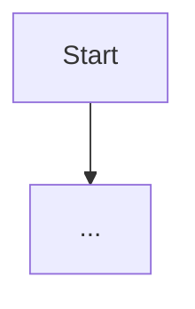

<!-- SIGMA:DOC type=ROADMAP schema=1 -->
# ROADMAP

> FMN-owned implementation staging document. ROADMAP breaks a locked Director Intent into build stages before each stage is converted into FMN-PLAN. ROADMAP is mandatory — `sigma plan new` requires a ROADMAP for the current INTENT version.
> ROADMAP version = INTENT major version. ROADMAP stays DRAFT while it is the build backbone and auto-locks on `sigma close lock`.

---

<!-- SIGMA:ROADMAP:SECTION:OVERVIEW -->
## 1. Overview

[Manual, max ~5 sentences. Overall implementation direction, end output, and how it will be reached.]

---

<!-- SIGMA:ROADMAP:SECTION:CORE_PROCESS_FLOW -->
## 2. Core Process Flow

> Manual section. FMN writes the high-level product/system flow here as a diagram.
> This section is not regenerated by `sigma roadmap render`.



---

<!-- SIGMA:ROADMAP:SECTION:PLANNED_STAGE -->
## 3. Planned Stage

> Manual section, filled once at roadmap creation time by referencing the locked DIR-INTENT. Records the initial stage breakdown as planned — how many stages, their titles, and their focus — before any FMN-PLAN exists.
> This is a planning snapshot, not a live tracker: it is never regenerated by `sigma roadmap render`. If actual implementation (Stage Overview below) later diverges from what was planned here, that is expected and not an error. Updating this table afterward is optional.

| Stage | Title | Focus |
| :--- | :--- | :--- |

---

<!-- SIGMA:RENDER:START:stage-overview -->
<!-- SIGMA:ROADMAP:SECTION:STAGE_OVERVIEW -->
## 4. Stage Overview

| Stage | Title | Focus | Status | Reason |
| :--- | :--- | :--- | :--- | :--- |

<!-- SIGMA:RENDER:END:stage-overview -->

---

## Roadmap Policy

ROADMAP is mandatory. `sigma plan new` is blocked without a ROADMAP for the current INTENT version.

ROADMAP is FMN-owned.

ROADMAP lives in `Sigma/roadmap/`.

ROADMAP is a living document — freely editable until project close.

ROADMAP auto-locks when `sigma close lock` is executed. FMN does not manually lock ROADMAP.

ROADMAP does not replace FMN-PLAN.

ROADMAP divides implementation into large stages before PLAN.

Stage title and focus are supplied via `--title`/`--focus` on `sigma plan new` / `sigma plan promote` and stored in `progress-v<N>.json` — there are no per-stage headings to write manually in this file.

The Stage Overview table is regenerated by `sigma roadmap render`. Never edit it manually — edits will be overwritten on next render.

Core Process Flow is manual. `sigma roadmap render` must never overwrite it.

Planned Stage is manual and distinct from Stage Overview: it records what was planned (from DIR-INTENT, at roadmap creation), while Stage Overview reflects what was actually built (from `progress-v<N>.json`, live). `sigma roadmap render` never touches Planned Stage. Keeping it in sync with reality is optional.

If ROADMAP conflicts with DIR-INTENT, DIR-INTENT wins.

If FMN-PLAN deviates from ROADMAP, FMN should explain the deviation or ask Director.

Control sentence:

```text
ROADMAP says how many big stages.
FMN-PLAN says what to build next.
```
