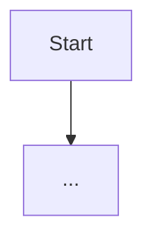

<!-- SIGMA:DOC type=ROADMAP schema=1 -->
# ROADMAP

> FMN-owned staging document. Breaks the locked INTENT into build stages, each later converted into an FMN-PLAN. Mandatory: `sigma plan new` requires a ROADMAP for the current INTENT version.
> ROADMAP version = INTENT major version. It stays DRAFT as the build backbone and auto-locks on `sigma close lock`.

---

<!-- SIGMA:ROADMAP:SECTION:OVERVIEW -->
## 1. Overview

[Manual, max ~5 sentences. Overall implementation direction, end output, and how it will be reached.]

---

<!-- SIGMA:ROADMAP:SECTION:CORE_PROCESS_FLOW -->
## 2. Core Process Flow

> Manual section. FMN writes the high-level product/system flow here as a diagram.
> This section is not regenerated by `sigma roadmap render`.

```mermaid
flowchart TD
  A[Start] --> B[...]
```

---

<!-- SIGMA:ROADMAP:SECTION:PLANNED_STAGE -->
## 3. Planned Stage

> Manual. Filled once at ROADMAP creation from the locked DIR-INTENT: the planned stages, each with title and focus. A planning snapshot that `sigma roadmap render` never regenerates. If Stage Overview later diverges, that is expected; updating this table is optional.

| Stage | Title | Focus |
| :--- | :--- | :--- |

---

<!-- SIGMA:RENDER:START:stage-overview -->
<!-- SIGMA:ROADMAP:SECTION:STAGE_OVERVIEW -->
## 4. Stage Overview

> Generated by the Sigma CLI. Do not edit.

| Stage | Title | Focus | Status | Reason |
| :--- | :--- | :--- | :--- | :--- |

<!-- SIGMA:RENDER:END:stage-overview -->
